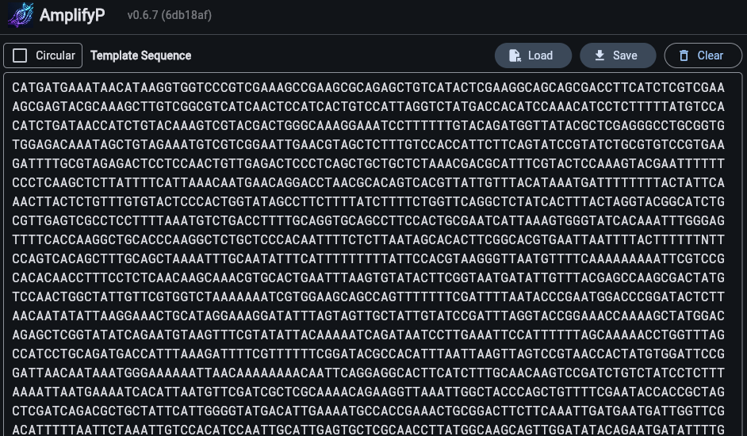
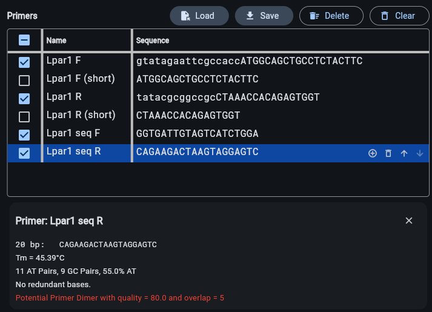
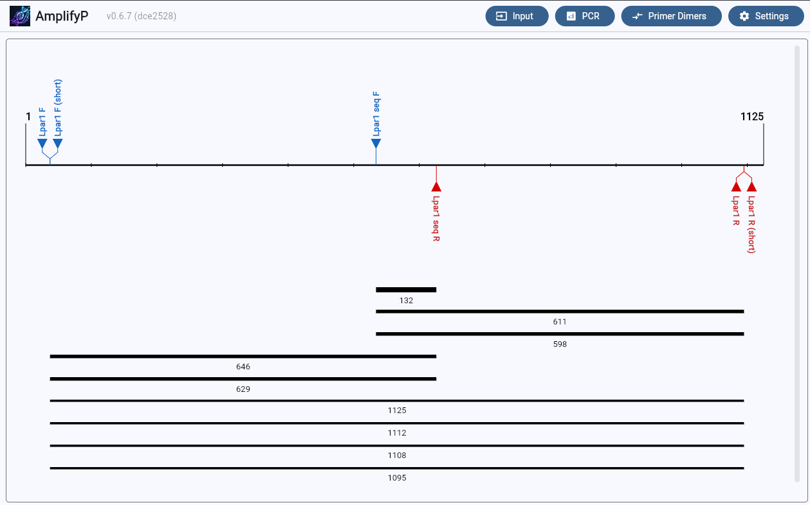
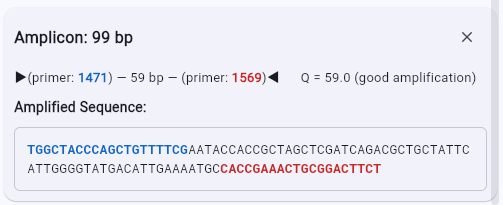

# AmplifyP


*AmplifyP* is a Mac program for simulating DNA amplification by the polymerase chain reaction. You supply the DNA sequences of one or more primers, and *AmplifyP* will generate a map of the expected outcome. It will also provide other helpful information such as the sequences of likely amplified fragments, warnings about potential primer dimers, etc.

*AmplifyP* is useful for planning experiments and for teaching students about PCR.

## Overview: How to use Amplify

### Step 1: Enter the target sequence and the primer sequences.

You need to tell *AmplifyP* the DNA sequences of the target area plus those of one or more primers. Primers are short fragments of synthesized DNA, typically around 20 bp. The target is usually a stretch of sequence from the genome of an organism whose DNA you want to amplify.

Paste the DNA sequences of the target area into the left side of the window and the sequence of one or more primers into the right side of the window.

### Step 2: Select one or more primers from the list

To the left of each primer sequence you will see a checkbox. You must check at least one to run a PCR, but you can check as many as you like.

### Step 3: Run the PCR simulation

When you choose **PCR** *AmplifyP* will draw a map of the expected outcome. You can now click on items in this drawing to get more information about each.

You can also save the results. The results consist of the map in the top half of the window and the textual output in the bottom half.

## The Amplify Windows

There are two kinds of windows in *Amplify*. One, the substrate window, contains the information you supply: the target sequence and the primers. The other, the PCR results window, contains the results of *Amplify*'s simulated PCR.

The substrate window is the one that shows up when you first open the program. It consists of a left and right portion with a "split window" vertical bar between them. You can move this vertical bar left and right to alter the relative size of the two parts. You can also resize the whole window. The left side contains the target sequence and the right side has the primer list.

When you run a simulated PCR a new PCR window will be generated. It also consists of two parts -- an upper part with the amplification map and a lower part with textual output. There is a moveable separator bar between them. The map is described in more detail below. The textual output contains information you request by clicking on elements of the map.

## Target Sequence

The target sequence for amplification appears as editable text in the left half of the substrate window. You can add a sequence to by copying and pasting or else by opening a text file.




### Allowable characters

The actual sequence part of the text (i.e., the text following any sequence header) must consist of the letters A, T, C, G or N (or a, t, c, g or n). Any other characters will be removed. Note that other IUB codes are allowed in the primer specifications but not in the target sequence.

## Primer List

The list of your available primers appears on the right side of the substrate window. It has columns for the primer's sequence, its name and any other "notes" you might want to include.

Your primers can be stored in a tab-delimited text file and opened within *AmplifyP* with the **Load** selection.

You can change the total width of the list, and also resize the individual columns by dragging the boundaries.

### Columns in the primer list

The sequence can include any of the IUB standard base codes: G, A, T, C and the ambiguous codes, M, R, W, S, Y, K, V, H, D, B and N. They can be upper or lower case, and are written in standard 5′ → 3′ order. The primer sequence may be no longer than 200 nt.

The primer names should be short, usually no more than 10 characters, so that they don't overlap when displayed on the map.



### Constructing a primer list

You can make your primer list right within *AmplifyP*, but it is also possible to use another program, such as a spreadsheet or text editor. You can even use a word processor, provided you use the option to save as plain text. Regardless of what software you use, the end result should be a plain text file where each primer is on a separate line, and the columns are separated by tabs. Alternatively, it can be a "csv" or "comma-separated value" file where the columns are delimited by commas and the file extension is `.csv`.

The order of the columns should be the same as in the primer list. That is: **Sequence - Name**. If you have a primer list with a different order, it is easy to change it within a spreadsheet program when columns can be dragged to any desired order.

### Selecting versus "checking" primers

In the example shown above, the primer named "Lpar1 seq R" is selected whereas, "Lpar1 F", "Lpar1 R", "Lpar1 seq F", "Lpar1 seq F" are checked. The difference is that those with a check-mark will be used in the PCR simulation whereas the selected primers are the ones affected by copying, editing, etc. Primers can be checked simply by clicking in the checkbox on the left.

### Copying and pasting primers and rearranging the list

Copying and pasting primers works as you would expect it to. When you choose **Save** a file containing all primers in the list will be saved to your computer. You can also clear the entire primer list by choosing **Clear**, or delete the selected primers by choosing **Delete**.

You can also copy primers from a text editor or spreadsheet program and paste them into *AmplifyP* by choosing **Load**. 

**Hint:** You can easily change the order of primers by selecting **Move Up** or **Move Down** for the selected primer. To quickly delete a selected primer or add a new one, use the **Add One** and **Delete buttons** in the selected primer row.

### Editing individual primers

To edit a sequence or name of particular primer, first select it by click on it. Then edit the entry. The modified name and sequence will be saved automatically.

### Primer information

Information about the top selected primer is shown in a box below the primer list.

## PCR Simulation

After entering the target sequence and primers into AmplifyP, you are ready to perform a PCR simulation.
Start by choosing one or more primers to use and clicking the checkbox beside each. Then, if necessary, enable the **Circular** checkbox if it corresponds to the type of template you are using, and then select PCR.
A new window will appear with the PCR results. There will be a map in the top half of the split screen and textual output in the bottom half. It might look like this:



### Primer matches

The red and blue arrows indicate where along the target sequence there are primer matches. The size of the arrows correlate with the strength of the match. The algorithms used by *AmplifyP* to identify matches estimate their strength are described below, and the parameters it uses can be set along with the other preferences.

Move your cursor over one of the match arrows to highlight it, and some information about the match will appear near the top of the window. Any amplicons (see below) that involve this match will also be highlighted.

When you click on a match arrow, a more detailed description will appear in the textual output below. For example, it might look like this:


`Primeability: 0.843` &nbsp; `Stability: 0.549` &nbsp; `Quality: 0.2409`

```text
                            1017               1036
                              │                  │
                              ▼                  ▼
1471                       5′-TGGCTACCCAGCTGTTTTCG-3′
                                   │ ││││ │ ││││││
       3′-GCACCAGATTTTTTTAGCACCTTCGTCGGTCAAAAAAAGCTAAAATTATGGGCTTACCTG-5′
Context 5′-CGTGGTCTAAAAAAATCGTGGAAGCAGCCAGTTTTTTTCGATTTTAATACCCGAATGGAC-3′
```


The primer sequence is shown aligned with the target sequence and the target base numbers are shown. Base matches and ambiguous matches are shown by the symbols `|` and `:` respectively. Computed values for the primality, stability and quality of the match are also given. (These quantities are defined elsewhere in this help file.)


### Amplified fragments ("amplicons")

The horizontal lines below the target and match arrows represent the DNA fragments that might be amplified by PCR. The number below each indicates its total length including the lengths of the two primers.

Move the cursor over a fragment to highlight it and show information about at the top of the window. The two matches that generated this fragment are also highlighted.

When you click on an amplicon a more detailed description will appear in the output panel below. For example:





It shows the complete sequence of the amplicon, including both primers which are set off with colors and lowercase text. The primer names (1471 and 1569) are given along with a number, Q, which can be used as a rough guide as to how strongly this fragment might amplify. Larger values of Q correspond to weaker amplification. Details of how Q is calculated are given below. Roughly speaking, it comes from the characteristics of the two matches plus the length of the fragment. When the primers match perfectly, then Q is equal to the amplicon's length.

### Primer dimers

Some primers have the potential to pair up in such a way that they can use each other as templates for DNA synthesis. This process prevents the primers from functioning properly in your reaction. Worse yet, the resulting small fragments can form a particularly nasty kind of contaminant in your lab, poisoning future reactions that use either of these two primers.

*AmplifyP* can show you pairs that it considers having some potential for dimer formation. Then you can decide for yourself whether the combination is dangerous to your reaction. To view the list of potential primer dimers, coose **Primer Dimers**, it shows you each potential dimer-forming pair. For example:

**Nest-a vs Nest-c**

`Overlap: 9 bp` &nbsp; `Quality: 240.0`

```text
Nest-c: 5′-TGTTATTTCATCATGggaacc-3′
                       │││││││││
Nest-a:             3′-GTACcctggtggaataca-5′
```


In this case, the pairing does not look particularly sinister, but there is some potential for problems. You can adjust the parameters and stringency used to determine which dimers are flagged by changing the settings in *AmplifyP* **Settings** section. The default settings are designed to err on the side of caution.

## PCR Algorithms

~~There is no perfect method that I know of for predicting exactly what will amplify and how well. The results of your PCR depend too sensitively on too many variables. However, after a lot of trial-and-error, I came up with an approach that has worked well in my lab. We started using this method more than 20 years ago, and have performed about a million reactions based on these predictions. So the methods have been well tested for the specific techniques we use. I have also received a great deal of feedback from *Amplify* users indicating that the predictions have worked well for them too. However, that doesn't guarantee that the standard methods in *Amplify* will work well for you. If they don't, you can change the settings in **Preferences…**, as discussed more below.~~

### The two-dimensional approach

The method used by *Amplify* is two dimensional. It computes two distinct attributes for each potential primer match, and displays the match only if each criterion exceed its pre-set threshold. If they do, the match is included, and the size of the arrow drawn on the map reflects the sum of the two quantities.

The two quantities are called "primability" and "stability." The difference is that the former gives most of the weight to base matches near the 3′ end, thus enabling the match to behave as a good PCR primer. The second weights each base match according to the length of run it is in. Thus, this quantity reflects the overall stability of the primer-target bond.

Both quantities make use of a table of pair scores to assign a numerical value to each potential base pairing. The default values for these scores are shown below, but they can be changed in the settings.

| Primer Base \ Target Base | G | A | T | C | N |
|---|---:|---:|---:|---:|---:|
| G | 100 | 0 | 0 | 0 | 30 |
| A | 0 | 100 | 0 | 0 | 30 |
| T | 0 | 0 | 100 | 0 | 30 |
| C | 0 | 0 | 0 | 100 | 30 |
| M | 0 | 70 | 0 | 70 | 30 |
| R | 70 | 70 | 0 | 0 | 30 |
| W | 0 | 70 | 70 | 0 | 30 |
| S | 70 | 0 | 0 | 70 | 30 |
| Y | 0 | 0 | 70 | 70 | 30 |
| K | 70 | 0 | 70 | 0 | 30 |
| V | 50 | 50 | 0 | 50 | 30 |
| H | 0 | 50 | 50 | 50 | 30 |
| D | 50 | 50 | 50 | 0 | 30 |
| B | 50 | 0 | 50 | 50 | 30 |
| N | 30 | 30 | 30 | 30 | 30 |


Call these values *Sij* where *i* refers to the primer base and *j* to the target base opposite it.

You might be wondering why I have assigned a large value to matching pairs, such as G-G and zero to complementary ones like G-C. Since the target is double-stranded, one can just as well think of a match as being between identical pairs, and I found it more intuitive that way.

### Primability

The *primability* is computed as:

$$
\mathrm{primability}
=
\frac{\displaystyle\sum_k m_k S_{ij}}
     {\displaystyle\sum_k m_k S_{\max}}
\times 100
$$

where $k$ is the base position starting with the 3′ end and proceeding either to the 5′ or to a pre-set upper limit, $i$ and $j$ are the bases in the primer and target, respectively, at position $k$, and $m$ is weighting factor which assigns greater weights near the 3′ end. The defaults, starting at the 3′ end are: 30, 20, 10, 10, 9, 9, 8, 7, 6, 5, 5, 4, 3, 2, 1, and so on. Finally, $S_{\max}$ is the largest possible $S$ value for primer base $i$. Thus, the *primability* is the percentage of the maximum weighted sum of pair scores.

### Stability

The *stability* formula is similar:

$$
\mathrm{stability}
=
\frac{\sum_k r_k S_{ij}}{r_n \sum_k S_{\max}}
\times 100
$$

where $r$ is a weighting factor corresponding to the longest run of matching bases that includes position $k$, and $n$ is the total effective length of the primer. The default values of $r$ are 100 for an isolated match, 150 for each base pair in a run of two matches, 175 for runs of three, then 182, 186 and so on. *Stability* also has the maximum sum in the denominator and is multiplied by 100 to make it a percentage.

### Quality

The *quality* of a match is defined as:

$$
\mathrm{quality}
=
\frac{\mathrm{primability}+\mathrm{stability}-\mathrm{cutoffs}}{200-\mathrm{cutoffs}}
$$

where *cutoffs* is the sum of the threshold values for *primability* and *stability*. For a perfect match, the *quality* is 1.0. This value is used by *Amplify* only to determine the size of the match arrows and the thickness of the lines for amplicons.

### Amplicon Q

The propensity for a particular fragment to amplify sufficiently to be detected depends not only on the quality of the left and right primer matches, but also on the length of the fragment. Short amplicons amplify better. Therefore, for each amplicon a quantity, $Q$ is computed defined as:

$$
Q
=
\frac{\text{length of fragment in bp}}
{\left[(\text{left match quality})(\text{right match quality})\right]^2}
$$

When the left and right primer matches are both perfect, $Q$ is equal to the length of the amplicon. When they are imperfect, $Q$ is larger.

### Primer dimer evaluation

For each possible primer-primer alignment, *AmplifyP* looks at the sum weight scores for each of the overlapping bases. The default scores for each possible base pair, including IUB ambiguous ones are as follows:

|   | G | A | T | C | M | R | W | S | Y | K | V | H | D | B | N |
|---|---:|---:|---:|---:|---:|---:|---:|---:|---:|---:|---:|---:|---:|---:|---:|
| G | -20 | -20 | -20 | 30 | 5 | -20 | -20 | 5 | 5 | -20 | -3 | -3 | -20 | -3 | -8 |
| A | -20 | -20 | 20 | -20 | -20 | -20 | 0 | -20 | 0 | 0 | -20 | -7 | -7 | -7 | -10 |
| T | -20 | 20 | -20 | -20 | 0 | 0 | 0 | -20 | -20 | -20 | -7 | -7 | -7 | -20 | -10 |
| C | 30 | -20 | -20 | -20 | -20 | 5 | -20 | 5 | -20 | 5 | -3 | -20 | -3 | -3 | -8 |
| M | 5 | -20 | 0 | -20 | -20 | -8 | -10 | -8 | -10 | 3 | -12 | -13 | -5 | -5 | -9 |
| R | -20 | -20 | 0 | 5 | -8 | -20 | -10 | -8 | 3 | -10 | -12 | -5 | -13 | -5 | -9 |
| W | -20 | 0 | 0 | -20 | -10 | -10 | 0 | -20 | -10 | -10 | -13 | -7 | -7 | -13 | -10 |
| S | 5 | -20 | -20 | 5 | -8 | -8 | -20 | 5 | -8 | -8 | -3 | -12 | -12 | -3 | -8 |
| Y | 5 | 0 | -20 | -20 | -10 | 3 | -10 | -8 | -20 | -8 | -5 | -13 | -5 | -12 | -9 |
| K | -20 | 0 | -20 | 5 | 3 | -10 | -10 | -8 | -8 | -20 | -5 | -5 | -13 | -12 | -9 |
| V | -3 | -20 | -7 | -3 | -12 | -12 | -13 | -3 | -5 | -5 | -9 | -10 | -10 | -4 | -8 |
| H | -3 | -7 | -7 | -20 | -13 | -5 | -7 | -12 | -13 | -5 | -10 | -11 | -6 | -10 | -9 |
| D | -20 | -7 | -7 | -3 | -5 | -13 | -7 | -12 | -5 | -13 | -10 | -6 | -11 | -10 | -9 |
| B | -3 | -7 | -20 | -3 | -5 | -5 | -13 | -3 | -12 | -12 | -4 | -10 | -10 | -9 | -8 |
| N | -8 | -10 | -10 | -8 | -9 | -9 | -10 | -8 | -9 | -9 | -8 | -9 | -9 | -8 | -9 |

These scores can be modified in the *AmplifyP* preferences. For a given pair of primers, only the alignment with the greatest sum of scores is shown, and only if this sum exceeds the minimum value, also defined in the preferences.

## Setting the Preferences

You can change the *AmplifyP* settings by selecting **Settings** under. The preferences window has four tabbed panels:

- Origin of Replication Settings
- Primer Melting Temperature (TM) Settings
- Primer Dimer Settings
- Apperance Settings
- About AmplifyP

Changes you make in any of these panels only take effect when you hit the **Apply** button. At any point, you can hit **Reset to Default** to get back to the original values.

You can also save all your settings to a file or load the settings from any previously-saved file.

### Origin of Replication Settings panel

If you understand what you are doing, this section allows you to modify the coefficients used to calculate primer-template binding.

The **Primability Cutoff** and **Stability Cutoff** are used to determine which matches are shown on the PCR map. A match must satisfy both conditions.

The **Amplify4 Compatibility Mode** feature is not recommended and is intended only to make AmplifyP results more closely match those of its predecessor, Amplify4.

### Primer Melting Temperature (TM) Settings

Here you can choose the preferred algorithm for calculating primer annealing and modify several other PCR reaction parameters, such as ion and enzyme concentrations.

### Primer Dimer Settings

Here you can set the weight, overlap, and threshold parameters used for primer dimer calculations.

### Apperance Settings

Here you can customize the appearance of *AmplifyP*.

### About AmplifyP

Information about the current version and links to the repository.

