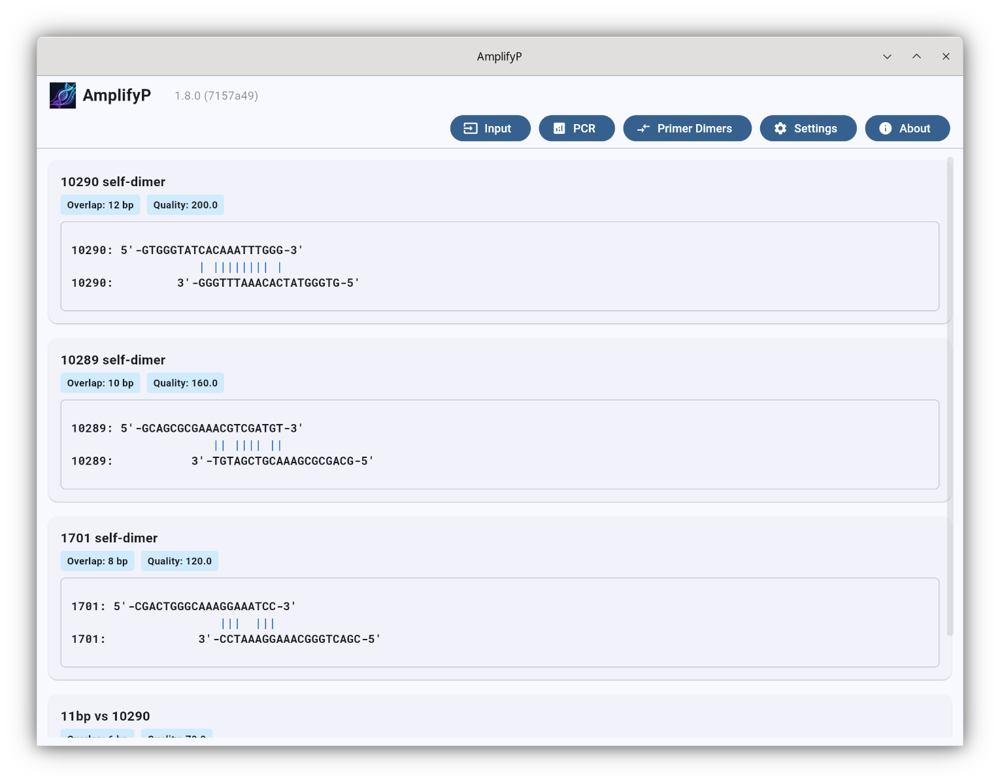
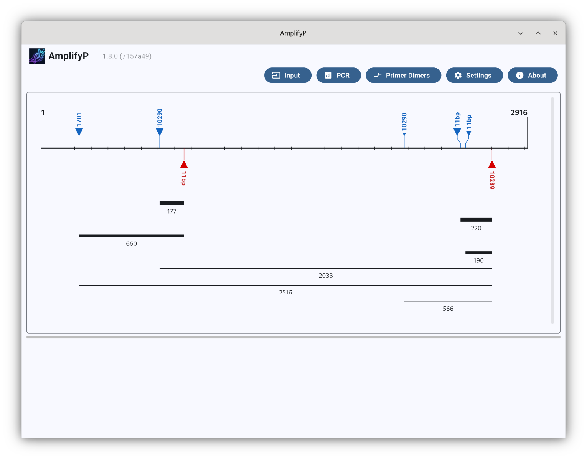

# AmplifyP

AmplifyP is a open source cross-platform program for simulating and testing
polymerase chain reactions (PCRs). It can be used as a tool for designing
primers by evaluating candidates. It is useful for planning experiments as well
as for teaching students about PCR.

To use AmplifyP, you supply the DNA sequences of one or more primers plus a
length of target DNA sequence, and AmplifyP will generate a map of the expected
outcome. It will also provide other helpful information such as the sequences of
likely amplified fragments, warnings about potential primer dimers, etc.

AmplifyP is a Python rewrite of William Engels's Amplify 4. For a short history
of Amplify, please refer to the [history](docs/history.md) document.

AmplifyP can be used as a graphical user interface (GUI) application (with some
screenshots below), however it is written with programmers in mind. The GUI is
composed on top of the underlying PCR calculation code, which can be easily
accessed programmatically.

|   Input View (Template & Primer Management)   |                 Primer Dimer Analysis View                  |
| :-------------------------------------------: | :---------------------------------------------------------: |
|      |  |
|          **PCR View (Amplicon Map)**          |       **PCR View (Primer Binding Site and Amplicon)**       |
|  |                |

AmplifyP is available on Linux, Windows and macOS, as well as a web application.

______________________________________________________________________

## Quick start

### Web version

The easiest way to run AmplifyP is to use the web version. The current stable
version of AmplifyP is deployed as a static GitHub PAges site:

- **[AmplifyP Web Version](https://fangfufu.github.io/AmplifyP/)**

### Binary releases

The binary releases of AmplifyP is available at the GitHub release page:

- **[AmplifyP Binary Releases](https://github.com/fangfufu/AmplifyP/releases)**

For **Linux**, you can either download the AppImage or download the tarball.
Both versions are pretty much the same. Some people prefer the AppImage as it is
a single binary. However, please note that certain security settings can prevent
AppImages from running.

For **Windows**, you can either download the ZIP file, or the installer. Both
versions are pretty much the same. To use AmplifyP, it does not actually need to
be installed. However if you run the installer, it would set up shortcuts for
you.

For **macOS**, you can download the DMG file. Please note that I am not a
certified Apple Developer, so there will be security warnings. The Mac binary is
generated by GitHub workflow. I do not actually have access to a Mac, so I
cannot guarantee that the DMG file and the binary inside actually works. The
binary generated should be a universal binary.

The **web** version runs purely on client-side, no computation is done on the
server itself. However you do actually need to run a static web server and
access AmplifyP via the web server. This is due to browser security restriction.

______________________________________________________________________

## Running AmplifyP from the source code repository

If you don't want to run the pre-built binaries, you can run AmplifyP from the
source repository. AmplifyP requires **Python 3.12** or higher.

To run AmplifyP from the source repository, you need to follow these steps:

1. Clone the repository and navigate to the directory:
   ```bash
   git clone https://github.com/fangfufu/AmplifyP.git
   cd AmplifyP
   ```
2. Set up and source your Python virtual environment under `.venv` at the root
   of the repository:
   ```bash
   python -m venv .venv
   source .venv/bin/activate
   ```
3. Install the application and its runtime dependencies:
   ```bash
   pip install .
   ```

If you want to do development on AmplifyP, please refer to the
[Developers' and Contributors' Guide](src/README.md)

______________________________________________________________________

## AmplifyP API

It is possible to perform PCR simulation by directly calling AmplifyP's API,
bypassing the GUI. If you have a lot of primers and/or a lot of templates, you
may wish to write a script of a program go through them, rather than having to
click through the GUI. Below is some example code.

```python
from amplifyp.dna import DNA, Primer, DNAType
from amplifyp.pcr import PCR

template = DNA("CATGATGA...", DNAType.LINEAR, name="Template")
primer_fwd = Primer("CGACTGGGCAAAGGAAATCC", name="FwdPrimer")
primer_rev = Primer("GTGGGTATCACAAATTTGGG", name="RevPrimer")

pcr = PCR(template)
pcr.add_primer(primer_fwd)
pcr.add_primer(primer_rev)
pcr.predict_amplicons()

for amplicon in pcr.amplicons:
    print(
        f"Product length: {len(amplicon.product)} bp, Q-score: {amplicon.q_score:.2f}"
    )
```

For the full guide on using AmplifyP API, please refer to the
[Python API Guide](docs/api_guide.md)

______________________________________________________________________

## Further Readings

For more documentation, please refer to:

- **[Amplify History](docs/history.md)**: A brief history of the Amplify
  software series.
- **[GUI User Guide](docs/gui_guide.md)**: A detailed manual for running
  simulations, primer management, and configuration in the graphical
  application.
- **[Python API Guide](docs/api_guide.md)**: A developer guide with code
  snippets demonstrating programmatic PCR simulation, dimer analyses, and Tm
  calculations.
- **[Development Guide](src/README.md)**: Information on setting up development
  dependencies, linters, hot-reload, and Pyodide web builds.
- **[Windows Setup Guide](docs/windows_setup.md)**: A step-by-step developer
  guide for setting up the environment, running tests, and compiling installers
  on Windows.

______________________________________________________________________

## Attribution

- **William Engels (Amplify4)**: This project is based on the original
  [Amplify4](https://github.com/wrengels/Amplify4) software.
- **Roboto Mono Font**: Licenced under the SIL Open Font License, Version 1.1.
  Copyright 2015 The Roboto Mono Project Authors.

______________________________________________________________________

## Licence

This project is licensed under the GPL-3.0 Licence. See the [LICENSE](LICENSE)
file for details.
