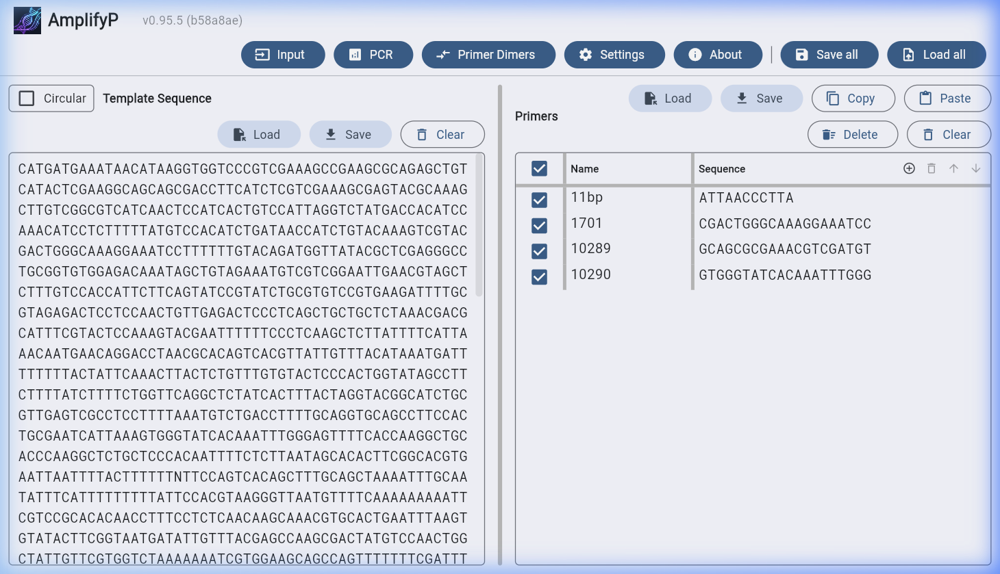
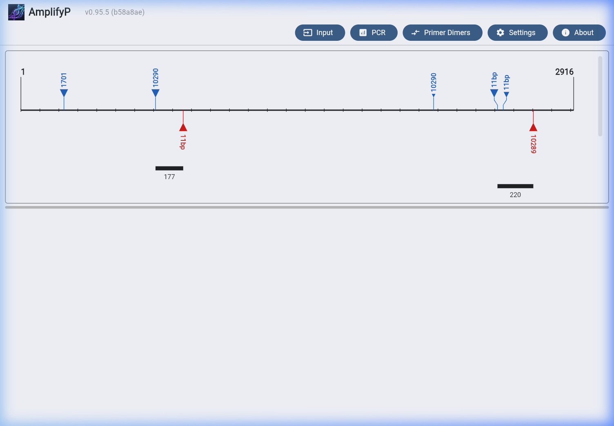

# AmplifyP

[](LICENSE)
[](pyproject.toml)

AmplifyP is a modern, high-performance Python rewrite of William Engels's
classic **Amplify4** software for simulating **Polymerase Chain Reaction
(PCR)**. By accurately modeling primer binding kinetics, primability, and
thermal melting properties, AmplifyP helps molecular biologists and researchers
predict DNA amplification products (amplicons) and detect primer-dimer formation
risks.

A live web version is available on
**[GitHub Pages](https://fangfufu.github.io/AmplifyP/)**.

______________________________________________________________________

## Key Features

- **PCR Simulation**: Predict amplicons, product sequences, and lengths using
  rigorous primer-template binding models. Supports linear and circular
  (plasmid) templates.
- **Cross-Platform GUI**: Built with [Flet](https://flet.dev/) (a Flutter-based
  UI framework) providing a beautiful, responsive interface for desktop (macOS,
  Windows, Linux) and web browsers.
- **Biophysical Scoring Engine**: Evaluates binding sites using length-wise and
  pairwise weight tables to compute primability, stability, and quality.
- **Primer Dimer Analysis**: Detects and scores self-dimers and cross-dimers
  between primer pairs.
- **Thermodynamic melting calculations**: Calculates Tm of hybrids using
  nearest-neighbour thermodynamics with modern salt corrections.
- **Programmatic Python API**: Fully typed and structured developer-friendly API
  for integration into bioinformatics pipelines.
- **State Serialisation**: Easily save and load templates, primers, settings,
  and replication parameters using standard YAML files.

______________________________________________________________________

## Quick Start: Download Pre-built Binaries (No Python Required)

If you only want to use the graphical application and do not wish to clone the
repository, install Python, or configure virtual environments, you can download
pre-built, standalone executable binaries directly.

Go to the **[GitHub Releases](https://github.com/fangfufu/AmplifyP/releases)**
page to download the latest version for your platform:

- **Windows**: Download the `.zip` archive, extract it, and run `AmplifyP.exe`.
- **Linux**: Download the `.tar.gz` archive, extract it, and run the binary.
- **macOS**: Download the `.dmg` installer (untested as the author does not have
  a Mac).

______________________________________________________________________

## Installation from Source

AmplifyP requires **Python 3.12** or higher.

To install the package and run it from source:

1. Clone the repository and navigate to the directory:

   ```bash
   git clone https://github.com/fangfufu/AmplifyP.git
   cd AmplifyP
   ```

1. Set up and source your Python virtual environment under `.venv` at the root
   of the repository:

   ```bash
   python -m venv .venv
   source .venv/bin/activate
   ```

1. Install the application and its runtime dependencies:

   ```bash
   pip install .
   ```

______________________________________________________________________

## Usage

### 1. Launching the Graphical User Interface (GUI)

Run the application from source:

```bash
python src/main.py
```

To launch it locally as a web application in your browser at port `34521`:

```bash
python src/main.py --web
```

To load a saved session state on startup:

```bash
python src/main.py --state tests/examples/save_states/simple.yaml
```

### 2. Live Web Version

Access the fully client-side static web application compiled to Pyodide:
**[https://fangfufu.github.io/AmplifyP/](https://fangfufu.github.io/AmplifyP/)**

### 3. Programmatic Python API

```python
from amplifyp.dna import DNA, Primer, DNAType
from amplifyp.pcr import PCR

template = DNA("CATGATGA...", DNAType.LINEAR, name="Template")
primer_fwd = Primer("CGACTGGGCAAAGGAAATCC", name="FwdPrimer")
primer_rev = Primer("GTGGGTATCACAAATTTGGG", name="RevPrimer")

pcr = PCR(template)
pcr.add_primer(primer_fwd)
pcr.add_primer(primer_rev)
pcr.predict_amplicons()

for amplicon in pcr.amplicons:
    print(f"Product length: {len(amplicon.product)} bp, Q-score: {amplicon.q_score:.2f}")
```

______________________________________________________________________

## Graphical User Interface Preview

### Substrate View (Template & Primer Management)



### PCR Results View (Amplicon Prediction & Binding Alignment)



______________________________________________________________________

## Documentation Directory

For complete documentation, please refer to:

- **[GUI User Guide](docs/gui_guide.md)**: A detailed manual for running
  simulations, primer management, and configuration in the graphical
  application.
- **[Python API Guide](docs/api_guide.md)**: A developer guide with code
  snippets demonstrating programmatic PCR simulation, dimer analyses, and Tm
  calculations.
- **[Development Guide](src/README.md)**: Information on setting up development
  dependencies, linters, hot-reload, and Pyodide web builds.

______________________________________________________________________

## Attribution & License

- **William Engels (Amplify4)**: This project is based on the original
  [Amplify4](https://github.com/wrengels/Amplify4) software.
- **License**: This project is licensed under the GPL-3.0 License. See the
  [LICENSE](LICENSE) file for details.
