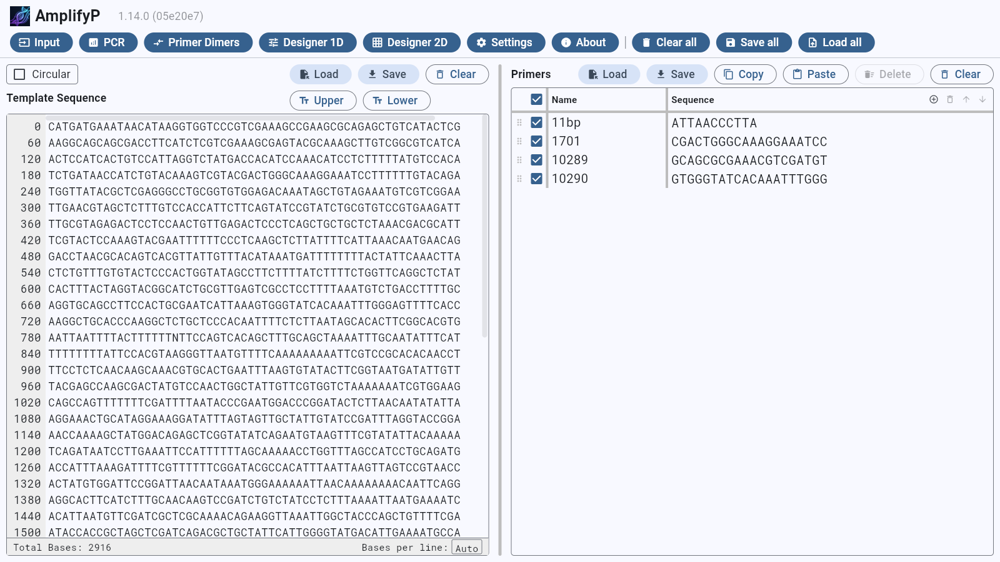
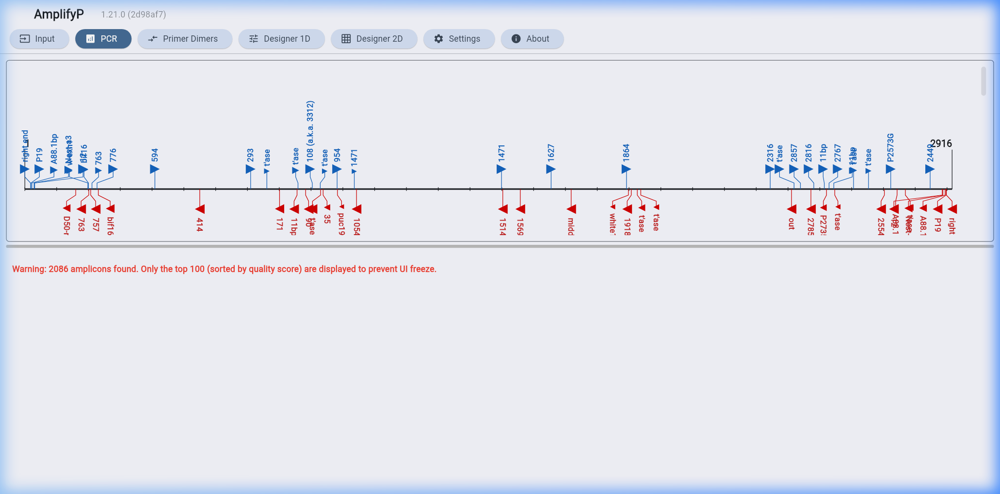
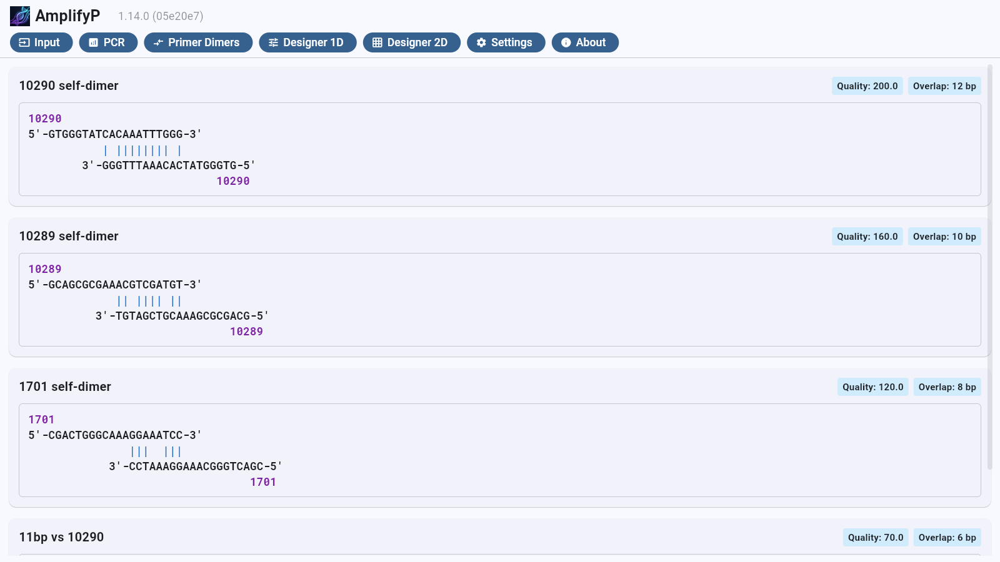

# AmplifyP GUI User Manual

This manual is for users who want to use the graphical user interface (GUI) of
**AmplifyP**.

AmplifyP is a Python rewrite of William Engels's **Amplify4** Mac program,
enabling it to be run cross-platform, including Linux, Windows and Mac.

<table>
  <tr>
    <td width="33%" align="center">
      <b>Template & Primer Management</b>
    </td>
    <td width="33%" align="center">
      <b>Primer Binding Site & Amplicon</b>
    </td>
    <td width="33%" align="center">
      <b>Primer Dimer Analysis</b>
    </td>
  </tr>
  <tr>
    <td width="33%" align="center">
      
    </td>
    <td width="33%" align="center">
      
    </td>
    <td width="33%" align="center">
      
    </td>
  </tr>
</table>

## Overview: How to Use the GUI

The application workspace consists of three primary tabs at the top of the
interface:

1. **Substrate**: Where you input the target DNA sequence and manage your list
   of primers.
2. **PCR Results**: Where the PCR simulation map and predicted amplicon details
   are displayed.
3. **Primer Dimers**: Where potential primer-primer binding configurations are
   analysed.

## 1. The Input View

The **Input View** is the main window where you configure your experiment. It is
divided into a target sequence panel on the left and a primer list panel on the
right.

### Target Sequence Panel (Left)

- **Sequence Input**: Paste or type your target DNA sequence. Valid base
  characters are standard nucleotides (`A`, `T`, `C`, `G`) and
  wildcard/ambiguous bases (`N`). Non-nucleotide characters (such as spaces or
  numbers) are automatically filtered out.
- **Topology Toggle**: Toggle the DNA topology between **Linear** and
  **Circular** (useful for simulating plasmid PCR).
- **Line Numbers**: The left column displays the base index at the start of each
  row, which adjusts dynamically if you resize the window.
- **Base Style Actions**: Choose to convert sequences to uppercase or lowercase,
  or invert (flip/reverse-complement) the entire sequence.

### Primer List Panel (Right)

- **Active Primers**: Use the checkbox in the **Active** column to check primers
  you wish to include in the PCR simulation. Only checked primers will be used.
- **Manage Primers**:
  - Click the **+** button to add a new primer row.
  - Click the **-** button to delete selected primers.
  - Double-click or click inside cells to edit the **Sequence**, **Name**, or
    **Notes**.
- **Actions**:
  - **Flip Sequence (🔄)**: Reverses and complements the sequence of the selected
    primer.
  - **Save / Load States**: Save all template sequences, primers, and settings
    to a local YAML file (`.yaml`), or reload a saved configuration to resume
    your work.

## 2. PCR View

Click the **PCR** tab to run the simulation. The screen is split into a visual
lane/map at the top and a detailed textual analysis panel at the bottom.

### The PCR Map (Top Panel)

- **Primer Match Arrows**: Red (forward) and blue (reverse) arrows show where
  primers bind to the target DNA. The size of the arrow indicates the strength
  of the match. Hovering over an arrow displays basic statistics in the tooltip.
- **Predicted Amplicons**: Horizontal lines below the arrows represent the
  predicted PCR products. The label displays the length of the fragment in base
  pairs (including the primers).

### Textual Analysis (Bottom Panel)

Click on any primer match arrow or amplicon line in the map to see comprehensive
details in the output log:

- **Primer Match Details**: Alignments show exactly where the primer binds to
  the template. Base pairings are marked with a vertical bar (`|`) for exact
  matches and a colon (`:`) for ambiguous matches. It also shows:
  - **Primability**: A percentage score weighting matches heavier near the
    critical 3' end.
  - **Stability**: A percentage score reflecting the overall binding stability
    across the primer length.
  - **Quality**: A normalises score between 0.0 and 1.0 based on the sum of
    primability and stability.
- **Amplicon Details**: Selecting an amplicon displays its complete sequence
  (with primer regions highlighted), primer names, and the quality score ($Q$).
  - **Amplicon Q**: Short fragments amplify better. The quality score is defined
    as: $$Q = \\frac{\\text{Length of fragment in bp}}{(\\text{Left Match
    Quality} \\times \\text{Right Match Quality})^2}$$ For perfect primer
    matches, $Q$ is equal to the amplicon length. Poorer primer matches result
    in a larger $Q$ value (lower amplification efficiency).

## 3. Primer Dimers View

Select the **Primer Dimers** tab to run a primer-primer hybridization analysis.
AmplifyP evaluates all combinations of active primers (both self-dimers and
cross-dimers) to warn you about potential secondary structures.

- **Dimer Alignments**: Shows the optimal antiparallel alignment between the two
  primers (usually aligning the 3' end of the shorter primer with the longer
  primer).
- **Match Quality**: Dimers are sorted by quality score. A high score suggests a
  high risk of primer-dimer formation, which can poison your PCR reaction.
- **Visualisation**: Identifies complementary base pairs using `|` (perfect
  match) and `:` (weak/ambiguous match).

## 4. Designer 1D View

The **Designer 1D** tab performs 1D primer truncation analysis. It takes a
single DNA sequence and progressively truncates it from the 3' end down to a
minimum length, evaluating self-dimer potential at each truncation step.

### Truncation Parameters (Top-Left Panel)

- **Candidate Primer Sequence**: Enter the target DNA sequence to analyse. Valid
  nucleotide characters (`A`, `T`, `C`, `G`) are accepted; invalid characters
  are filtered out.
- **Min Length (bp)**: The minimum primer length for truncation (default 18).
  The analysis generates one candidate primer per base from the full length down
  to this minimum.
- **Primer Direction**: Choose **Forward** (truncation from the 3' end) or
  **Reverse** (truncation from the 5' end).
- **Max Quality**: Optional quality threshold. Self-dimers with quality scores
  above this value are excluded from results. Leave empty for no filtering.
- **Max Overlap (bp)**: Optional maximum overlap constraint. Self-dimers with
  overlap greater than this value are excluded. Leave empty for no filtering.

### Generated Primers (Bottom-Left Panel)

Each truncation step produces a candidate primer. The list shows all generated
primers with their sequence, length, and quality metrics. Click on a primer to
display its self-dimer analysis card in the right panel.

### Self-Dimer Quality Chart (Top-Right Panel)

A bar chart displaying the self-dimer quality score for each primer by size
(bp). The chart is resizable — drag the horizontal divider to adjust height.
Click on a bar to select the corresponding primer and view its self-dimer card.

### Self-Dimer Cards (Bottom-Right Panel)

Clicking a primer or chart bar opens a detailed self-dimer card showing the
alignment, match quality, and binding statistics. Cards can be dismissed
individually or cleared all at once with the **Clear Cards** button.

### Save / Load

Parameters (DNA sequence, min length, direction, filters) can be saved to a YAML
file and reloaded to resume work.

## 5. Designer 2D View

The **Designer 2D** tab performs 2D primer truncation analysis. It takes
separate forward and reverse DNA sequences and truncates each from the 3' end
down to a minimum length, evaluating all combinations of forward-reverse primer
pairs.

### Truncation Parameters (Top-Left Panel)

- **Forward Candidate Primer Sequence**: The forward primer target sequence.
- **Fwd Min Len (bp)**: Minimum length for forward primer truncation (default
  18).
- **Reverse Candidate Primer Sequence**: The reverse primer target sequence.
- **Rev Min Len (bp)**: Minimum length for reverse primer truncation (default
  18).
- **Quality Filter**: Optional minimum quality threshold for primer pairs. Pairs
  below this score are excluded. Leave empty for no filtering.
- **Overlap Filter (bp)**: Optional maximum overlap constraint for primer pairs.
  Leave empty for no filtering.
- **Metric**: Choose **Max** (use the maximum dimer quality across all steps) or
  **Mean** (use the average) to rank and filter results.

### Results Grid (Bottom-Left Panel)

A colour-coded grid showing all forward-reverse primer pair combinations. Each
cell represents a pair at a specific truncation step, with quality scores mapped
to colours for quick visual identification. Click on a cell to view the detailed
pair analysis in the right panel.

### 2D Primer Pair Detail Cards (Right Panel)

Selecting a grid cell opens a detail card showing the forward and reverse primer
sequences, their alignment, quality scores, and binding statistics. Cards can be
dismissed individually or cleared with the **Clear Cards** button.

### Save / Load

Parameters (both sequences, minimum lengths, filters, metric) can be saved to a
YAML file and reloaded to resume work.

## 6. Settings & Preferences

You can customise the matching and dimer algorithms. To open settings, click the
gear icon or settings button in the GUI:

- **General**: Customise default directories, fonts, and state persistence.
- **PCR Match Settings**:
  - **Maximum Effective Primer**: Defaults to 30 bp. If a primer is longer, only
    the 30 bases from the 3' end are evaluated for matches (though the entire
    primer is amplified).
  - **Cutoffs**: Set the minimum **Primability Cutoff** and **Stability Cutoff**
    percentages. Matches below these thresholds are ignored.
  - **Pairwise Weights**: Customise base pairing scores and weighting factors
    for runs of matches.
- **Tm Calculations**: Configure monovalent and divalent salt concentrations,
  primer concentrations, and thermodynamic parameters (SantaLucia vs.
  Lander-Amplify4).
- **Primer Dimers**: Customise weights and minimum scoring thresholds for dimer
  detection.
