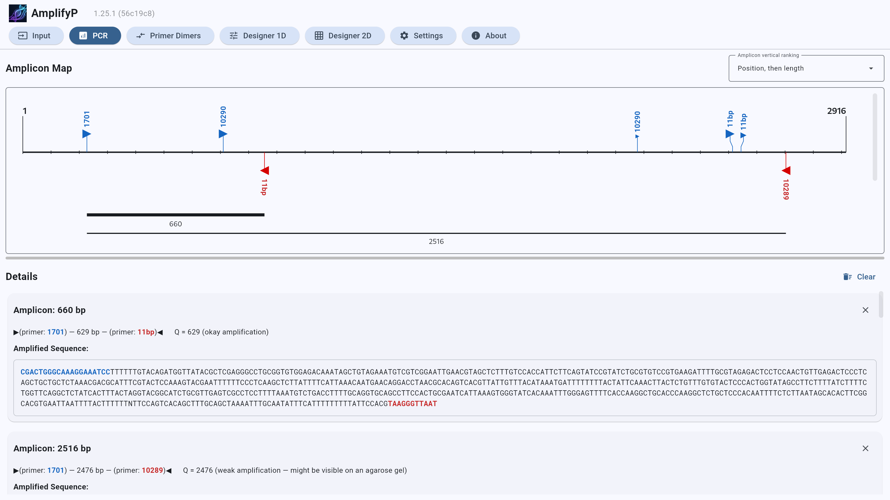

# AmplifyP GUI — PCR View

Click the **PCR** tab to run the simulation. The screen is split into a visual
lane/map at the top and a detailed, interactive analysis cards panel at the
bottom.

## The Overview Map (Top Panel)

The top panel visually renders template DNA, primer binding sites, and predicted
PCR amplicons on an interactive canvas.

- **Template DNA Baseline**: A horizontal line in the theme surface colour
  (black in light themes) represents the template DNA length (from base 1 to
  base $N$). Vertical boundary lines mark the start and end of the template,
  with dynamically scaled tick marks (spaced at 100, 500, or 1000 bp intervals
  depending on template length).
- **Amplicon Vertical Ranking**: A dropdown next to the **Amplicon Map** title
  controls the vertical ordering of amplicon bars (`Position, then length`
  [default], `Quality score`, `Position, then quality`). The choice is persisted
  to the PCR settings tile and redraws the map immediately.
- **Primer Match Indicators**:
  - **Forward Primers**: Rendered in **blue** floating above the baseline as
    right-pointing triangles (indicating $5'$ to $3'$ forward synthesis),
    accompanied by connector lines and vertically rotated primer name labels.
  - **Reverse Primers**: Rendered in **red** floating below the baseline as
    left-pointing triangles (indicating $5'$ to $3'$ reverse synthesis),
    accompanied by connector lines and vertically rotated primer name labels.
  - **Match Strength Scaling**: Triangle sizes scale dynamically between 7.0 and
    16.0 pixels proportional to primer binding match quality.
  - **Overlap De-collision**: Closely spaced primer binding sites automatically
    shift horizontally with bent leader lines connecting to their exact template
    position to prevent label overlap.
- **Predicted Amplicon Bars**:
  - Horizontal bars (theme surface colour) below the template baseline represent
    predicted PCR products.
  - **Bar Thickness**: Scaled dynamically according to quality score $Q$: 8.0 px
    for $Q < 300$, 5.5 px for $Q < 700$, 3.5 px for $Q < 1500$, 2.0 px for $Q \<
    4000$, and 1.0 px for $Q \\ge 4000$.
  - **Length Label**: Displays amplicon fragment length in base pairs (including
    primers) centred under each bar.
  - **Circular Template Support**: Wraparound amplicons crossing origin
    boundaries on circular templates are rendered as dual split segments across
    the canvas.
- **Resizable Container**: A drag handle (divider bar) below the canvas allows
  dragging vertically to resize the overview map container (minimum height 150
  px).
- **Safe Rendering Limits**: If more than 100 amplicons are predicted, amplicons
  are sorted according to the active **Amplicon vertical ranking** mode and only
  the top 100 are rendered on the map to prevent UI freezing. A red warning
  notification is displayed in the details panel:
  > *"Warning: {n} amplicons found. Only the top 100 (sorted by {ranking}) are
  > displayed to prevent UI freeze."*
- **Zero Amplicons Display**: If no amplicons are found, primer binding sites
  remain visible on the overview map, and a *"No amplicons found."* notice is
  shown in the details panel.

## Detailed Analysis Cards (Bottom Panel)

Clicking on any primer binding indicator or amplicon bar on the map dynamically
inserts a detailed, dismissible analysis card into the scrollable list below.

- **Card Management**: Individual cards can be dismissed using the close (**X**)
  button in the card header, or all cards can be cleared simultaneously using
  the **Clear** button. Clicking an element on the map again brings its existing
  card back to the top of the list.
- **Replication Context Card (Primer Binding Details)**:
  - **Binding Metrics**: Displays **Primeability** (weighted score favouring
    match perfection near the critical 3' end), **Stability** (overall
    structural binding stability), and overall **Quality**. Primeability and
    stability are shown as three-decimal fractions, or as whole percentages when
    Amplify4 compatibility mode is enabled. Quality is shown as a rounded
    integer and can be negative when the scores fall below the configured
    cutoffs.
  - **Visual Alignment Context Map**: Multi-line monospace text alignment
    showing exact template coordinates, 5' and 3' primer ends (formatted with
    the **5'/3' Sequence Separator** setting: space or dash), base pairing
    strength (`|` for exact matches, `:` for ambiguous/weak matches, space for
    mismatches), arrow markers (`V`), and 20 bp upstream/downstream template
    context.
  - **Complementary Strand**: When the *Improved Visualisation* setting is
    enabled, the complementary template strand ($3' \\to 5'$) is also rendered
    for forward primers.
- **Amplicon Detail Card**:
  - **Product Summary**: Displays the forward primer name (blue), internal
    fragment length, reverse primer name (red/pink), and Amplicon Quality Score
    ($Q$), e.g. `Q = 42 (good amplification)`. The quality report classifies the
    fragment as *good*, *okay*, *moderate*, *weak* (*"might be visible on an
    agarose gel"*), or *very weak* (*"probably not visible on an agarose gel"*),
    with a *(Circular)* suffix for wraparound products.
  - **Amplicon Quality ($Q$)**: Reflects fragment amplification efficiency based
    on the internal fragment length (excluding both primers) and primer match
    quality: $$Q = \\frac{\\text{Internal fragment length in bp}}{(\\text{Left
    Match Quality} \\times \\text{Right Match Quality})^2}$$ *(For perfect
    primer matches with quality 1.0, $Q$ equals the internal fragment length.
    Larger $Q$ values indicate lower amplification efficiency).*
  - **Amplified Sequence**: A labelled, monospace, selectable sequence box
    highlighting the forward primer region in **blue** (with a `▶` marker),
    internal product sequence in standard text, and reverse primer region in
    **red/pink** (with a `◀` marker).
- **Error Handling**: If the PCR calculation fails, a red error text with the
  traceback is shown and an *"Error running PCR"* dialog opens.

______________________________________________________________________

[Return to GUI Manual Index](README.md)
