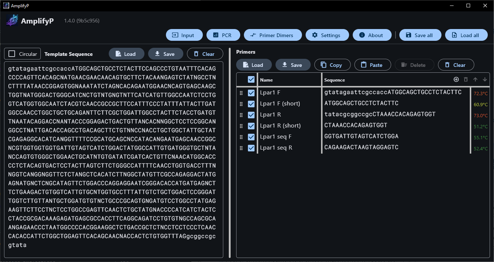

# AmplifyP GUI User Guide

This guide is for researchers and biologists who want to use the graphical user interface (GUI) of **AmplifyP** to run PCR simulations, predict amplicons, evaluate primer melting temperatures, assess primer binding sites and potential off-target priming, and analyse primer dimers.

AmplifyP is a modern Python rewrite of William Engels's classic [**Amplify4**](https://github.com/wrengels/Amplify4) Mac
program, updated to run in modern desktop environments and web browsers.

______________________________________________________________________

## Overview: How to Use the GUI

The application workspace consists of three primary tabs at the top of the
interface:

1. **Experiment Setup**: Where you input the target DNA sequence and manage your list
   of primers.
1. **PCR Results**: Where the PCR simulation map and predicted amplicon details
   are displayed.
1. **Primer Dimers**: Where potential primer-primer binding configurations are
   analysed.

______________________________________________________________________

## 1. The Experiment Setup

The **Experiment Setup** is the main window where you configure your experiment.
It is divided into a template sequence panel on the left and a primer list panel
on the right.

### Main Navigation and Session Controls

The top toolbar provides access to the main sections of AmplifyP and includes controls for saving or restoring the complete application state.

- **Input / Experiment Setup**: Opens the main workspace where you enter the template DNA sequence, manage primers, and prepare the PCR simulation.
- **PCR**: Opens the PCR results view and displays the predicted primer binding sites and amplicons based on the current template and active primers.
- **Primer Dimers**: Opens the primer dimer analysis view, where potential primer-primer interactions are evaluated.
- **Settings**: Opens the application settings, including PCR matching parameters, melting temperature options, primer dimer settings, and appearance preferences.
- **About**: Shows information about the current AmplifyP version and project details.
- **Save all / Load all**: Save or restore the complete application state as a YAML file (`.yaml`). This includes the template sequence, primer list, primer activity states, template topology, and application settings.

### Target Sequence Panel (Left)

- **Sequence Input**: Paste or type your target DNA sequence. Valid base
  characters are standard nucleotides (`A`, `T`, `C`, `G`) and
  wildcard/ambiguous bases (`N`). Non-nucleotide characters (such as spaces or
  numbers) are automatically filtered out.
- **Topology Toggle**: Toggle the DNA topology between **Linear** and
  **Circular** (useful for simulating plasmid PCR).
- ~~**Line Numbers**: The left column displays the base index at the start of each
  row, which adjusts dynamically if you resize the window.~~
- ~~**Base Style Actions**: Choose to convert sequences to uppercase or lowercase,
  or invert (flip/reverse-complement) the entire sequence.~~
- **Template Sequence Actions**: Use **Load** to import a template sequence from a plain text file (`.txt`), **Save** to export the current template sequence, or **Clear** to remove the sequence from the input field.

### Primer List Panel (Right)

- **Active Primers**: Use the checkbox in the **Active** column to check primers
  you wish to include in the PCR simulation. Only checked primers will be used.
- **Manage Primers**:
  - Click the **+** button to add a new primer row.
  - Click the **🗑️** button to delete selected primers.
  - Click inside cells to edit the **Sequence** or **Name**.
  - ~~**Flip Sequence (🔄)**: Reverses and complements the sequence of the selected
    primer.~~
  - Use **Load** to import a primer list from a CSV or tab-delimited text file (`.csv`) or (`.tsv`), **Save** to export the current primer list as a CSV file, **Copy** and **Paste** to transfer primer rows through the clipboard, **Delete** to remove the selected primer row or rows, and **Clear** to empty the primer list.
  - **Reordering Primers**: Change the order of primers by using the up **⬆️** and down **⬇️** arrow buttons, or drag a primer row by the handle icon **⠿** to move it freely within the list.
  - **Range Selection**: The handle icon **⠿** to the left of each primer checkbox can also be used for range selection. Double-click the handle of the first primer, then double-click the handle of the last primer. All primer rows between them, including both endpoints, will be selected as a group.

______________________________________________________________________

## 2. PCR Results View

Click the **Amplify** or **PCR Results** tab to run the simulation. The screen
is split into a visual lane/map at the top and a detailed textual analysis panel
at the bottom.

### The PCR Map (Top Panel)

- **Primer Match Arrows**: Red (forward) and blue (reverse) arrows show where
  primers bind to the target DNA. The size of the arrow indicates the strength
  of the match. Hovering over an arrow displays basic statistics in the tooltip.
- **Predicted Amplicons**: Horizontal lines below the arrows represent the
  predicted PCR products. The label displays the length of the fragment in base
  pairs (including the primers).

### Textual Analysis (Bottom Panel)

Click on any primer match arrow or amplicon line in the map to see comprehensive
details in the output log:

- **Primer Match Details**: Alignments show exactly where the primer binds to
  the template. Base pairings are marked with a vertical bar (`|`) for exact
  matches and a colon (`:`) for ambiguous matches. It also shows:
  - **Primability**: A percentage score weighting matches heavier near the
    critical 3' end.
  - **Stability**: A percentage score reflecting the overall binding stability
    across the primer length.
  - **Quality**: A normalises score between 0.0 and 1.0 based on the sum of
    primability and stability.
- **Amplicon Details**: Selecting an amplicon displays its complete sequence
  (with primer regions highlighted), primer names, and the quality score ($Q$).
  - **Amplicon Q**: Short fragments amplify better. The quality score is defined
    as: $$Q = \\frac{\\text{Length of fragment in bp}}{(\\text{Left Match
    Quality} \\times \\text{Right Match Quality})^2}$$ For perfect primer
    matches, $Q$ is equal to the amplicon length. Poorer primer matches result
    in a larger $Q$ value (lower amplification efficiency).

______________________________________________________________________

## 3. Primer Dimers View

Select the **Primer Dimers** tab to run a primer-primer hybridization analysis.
AmplifyP evaluates all combinations of active primers (both self-dimers and
cross-dimers) to warn you about potential secondary structures.

- **Dimer Alignments**: Shows the optimal antiparallel alignment between the two
  primers (usually aligning the 3' end of the shorter primer with the longer
  primer).
- **Match Quality**: Dimers are sorted by quality score. A high score suggests a
  high risk of primer-dimer formation, which can poison your PCR reaction.
- **Visualisation**: Identifies complementary base pairs using `|` (perfect
  match) and `:` (weak/ambiguous match).

______________________________________________________________________

## 4. Settings & Preferences

You can customise the matching and dimer algorithms. To open settings, click the
gear icon or settings button in the GUI:

- **General**: Customise default directories, fonts, and state persistence.
- **PCR Match Settings**:
  - **Maximum Effective Primer**: Defaults to 30 bp. If a primer is longer, only
    the 30 bases from the 3' end are evaluated for matches (though the entire
    primer is amplified).
  - **Cutoffs**: Set the minimum **Primability Cutoff** and **Stability Cutoff**
    percentages. Matches below these thresholds are ignored.
  - **Pairwise Weights**: Customise base pairing scores and weighting factors
    for runs of matches.
- **Tm Calculations**: Configure monovalent and divalent salt concentrations,
  primer concentrations, and thermodynamic parameters (SantaLucia vs.
  Lander-Amplify4).
- **Primer Dimers**: Customise weights and minimum scoring thresholds for dimer
  detection.
